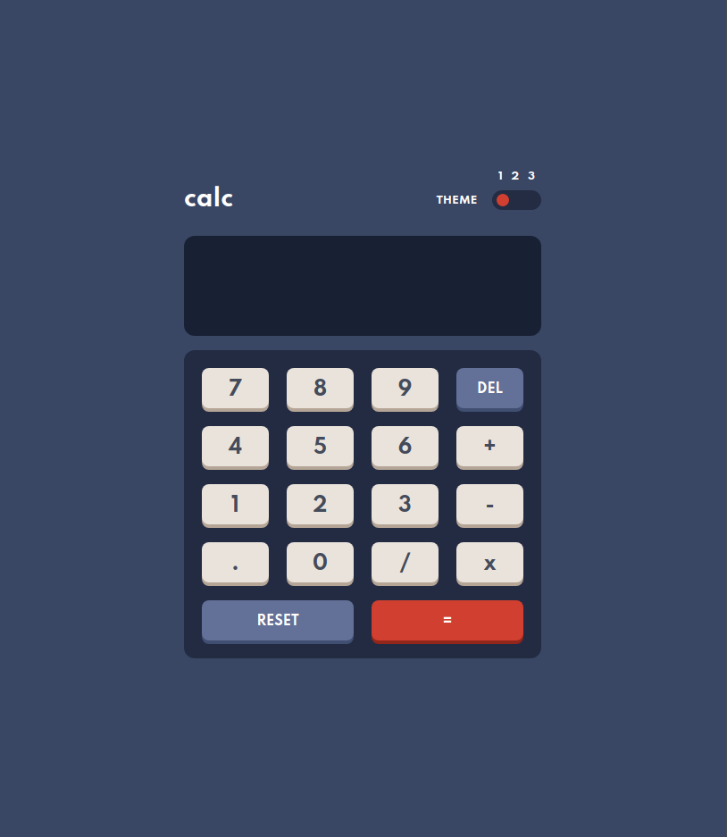
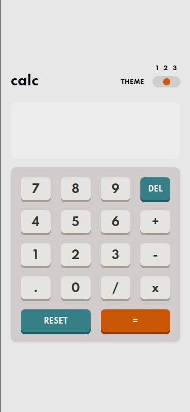
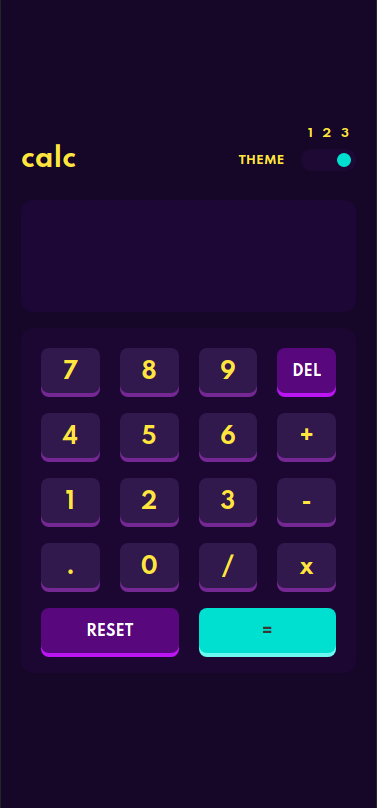

# Frontend Mentor - Calculator app 

This is a solution to the [Calculator app challenge on Frontend Mentor](https://www.frontendmentor.io/challenges/calculator-app-9lteq5N29). Frontend Mentor challenges help you improve your coding skills by building realistic projects.

## Table of contents

- [Overview](#overview)
  - [The challenge](#the-challenge)
  - [Screenshot](#screenshot)
  - [Links](#links)
- [My process](#my-process)
  - [Built with](#built-with)
- [Author](#author)

## Overview

### The challenge

Users should be able to:

- See the size of the elements adjust based on their device's screen size
- Perform mathmatical operations like addition, subtraction, multiplication, and division
- Adjust the color theme based on their preference
- **Bonus**: Have their initial theme preference checked using `prefers-color-scheme` and have any additional changes saved in the browser

### Screenshot

### Links

- Solution URL: [Github URL](https://github.com/atorres-io/frontend-mentor-calculator-app)
- Live Site URL: [Live URL](https://wizardly-hoover-860206.netlify.app/)

## My process

### Built with

- JavaScript
- Clean Code
- Theme Selector
- Flexbox
- CSS Grid
- Responsive
- [React](https://reactjs.org/) - JS library

## Author

- Instagram - [@atorres.designs](https://www.instagram.com/atorres.designs/)
- Frontend Mentor - [@atorres-io](https://www.frontendmentor.io/profile/atorres-io)
- Github - [@atorres-io](https://github.com/atorres-io)
- Codepen - [@atorres-designs](https://codepen.io/atorres-designs)
- LinkedIn - [@atorresalcala](https://www.linkedin.com/in/atorresalcala)
